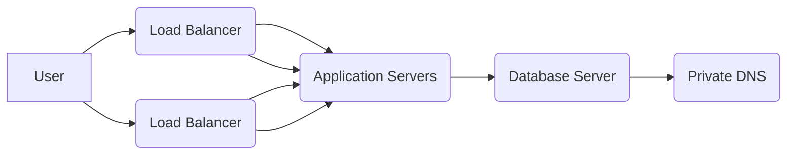

# IAW - Práctica 8
>IES Celia Viñas (Almería) - Curso 2020/2021   
>Módulo: IAW - Implantación de Aplicaciones Web   
>Ciclo: CFGS Administración de Sistemas Informáticos en Red 

## 1 Práctica 8: Implantación de Wordpress en Amazon Web Services (AWS) sobre la pila LAMP
En esta práctica tendremos que realizar la instalación de un sitio WordPress haciendo uso de los servicios de Amazon Web Services (AWS)

Despliega la última versión de Worpress utilizando la siguiente arquitectura propuesta:
#### Application and private DNS

